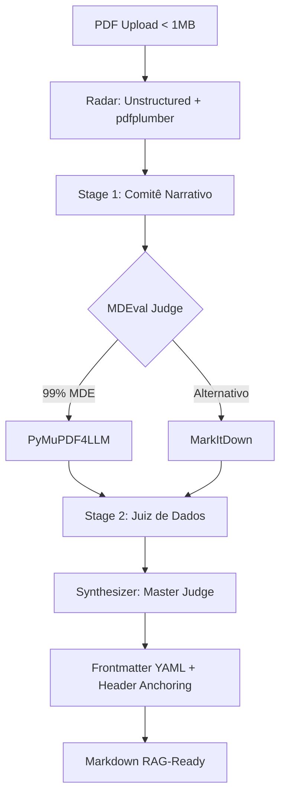

# Arquitetura do Orquestrador V2 ("Comitê de Especialistas")
**Projeto:** `br-pdf-to-md-to-rag`
**Objetivo:** Conversão hiper-estruturada de PDFs Brasileiros Sujos para Markdown 100% Otimizados para Bancos Vetoriais (RAG Ready).

---

## A Filosofia do Pipeline
Nenhuma ferramenta de extração de PDF no mercado é perfeita.
- Soluções Microsoft (MarkItDown): Ótimas em estrutura semântica de Cabeçalhos, mas péssimas em tabelas e vazam números soltos.
- Soluções PyMuPDF: Excelentes para não perder 1 caractere, mas perdem toda a hierarquia, tornando todo o documento uma sopa de letrinhas morta para o VectorDB.
- Soluções Docling / Marker: Incríveis em raciocínio visual (VRAM Intensive), mas pesadas demais (lentas) para texto simples.

### A Solução: Padrão "Comitê de Especialistas"
Nossa aplicação não escolhe uma ferramenta. Ela usa todas elas orquestradas em uma matriz paralela e usa "Juízes" pythonicos para decidir qual pedaço do trabalho é pego de qual ferramenta, resultando num super-documento (Frankenstein perfeito).

---

## O Ciclo de Vida do Documento passo a passo

### Passo 1: O Upload pelo Usuário (A Aplicação)
O usuário sobe um arquivo pelo **Streamlit app** (Interface Gráfica) ou usa nossa **CLI** (`convert_pdfs_to_md.py`) para processamento em lote. O documento, não importa o seu grau de sujeira ou escaneamento, cai no funil central: O Orquestrador.

### Passo 2: Fase 0 - O Radar Espacial (`src/radar/spatial_scanner.py`)
Antes de invocar as IAs pesadas ou extratores, executamos um "Radar". 
Usamos o motor da `unstructured` e `pdfplumber` numa leitura ultra-rápida de metadados para construir um `Manifesto da Página`.
- **O que ele faz:** Ele descobre onde estão as "ilhas" dentro do mar PDF. O PDF tem 10 páginas? Existe alguma tabela na página 3? Há alguma imagem não-vetorial na página 9? 
- Se a resposta for não, ele não invoca os especialistas de tabela/imagem, economizando horas de processamento computacional.

### Passo 3: Etapa 1 - O Juiz Narrativo (`src/judges/narrative_judge.py`)
Aqui processamos o texto corrido! Invocamos 2 extratores simultaneamente (concorrência):
1. **MarkItDown:** Garante que Títulos fiquem com a tag MarkDown `#` correta.
2. **PyMuPDF4LLM:** Garante que notas de rodapé essenciais não foram omitidas.
- **O que ele faz:** Ele conta os caracteres gerados pelas duas ferramentas. Se o volume for igual, vence o MarkItDown. Ele então pega esse molde de texto "Vencedor" e usa o GPS do passo anterior para abrir "buracos" (Âncoras de HTML `<!-- TABLE_ANCHOR_p3_t1 -->`) em todas os locais que ele sabe que havia uma tabela complexa. 

## 🏗️ Arquitetura Final: Smart-Lite Ensemble

A pipeline agora opera sob um regime de **Decisão Hierárquica por Saúde (MDEval)** em vez de volume ou prioridade fixa.

### Passo 4: Etapa 2 - O Juiz de Tabelas (`src/judges/data_judge.py`)
*(Só é acionado se a Fase 0 detectou blocos tabulares).*
Tabelas são destruídas por OCR genérico. Então, despachamos o serviço de alta precisão:
1. **Docling (IBM):** O poderoso modelo de tabela que consegue deduzir se existe uma "célula mesclada" e converte numa matriz MarkDown perfeita.
2. **PdfPlumber:** Uma checagem de "Raio X", focado em precisão geométrica.
- **O que ele faz:** Renderiza Tabelas Markdown limpas sem o lixo de texto externo e as envia isoladas na memória.

### Passo 5: Etapa 3 - O Juiz de Visão (`src/judges/vision_judge.py`)
*(Só é acionado se a Fase 0 detectou figuras não estruturadas ou escaneadas).*
1. **Marker-PDF:** Deep Learning pesado que pode ler gráficos gerando descrições textuais.
2. **PyTesseract:** OCR de emergência como Fallback, caso o Marker estoure a memória de placa de vídeo do usuário.
- **O que ele faz:** Extrapola pixels em caracteres e transforma em blocos de parágrafos suplementares.

### Passo 6: Etapa 4 - Síntese e Lixeira Heurística (`src/judges/master_judge.py`)
Todos os juízes voltam ao "Juiz Mestre", que agora tem em mãos o Esqueleto Narrativo (com buracos) e as Matrizes (limpas). 
- Ele joga as Matrizes exatamente em cima das âncoras (`<!-- TABLE_ANCHOR -->`).
Aí sim chamamos o **Cleaner Heurístico Brasileiro**. Ele arranca rodapés de diário oficial, numeração de páginas isoladas ("página 2 de 50"), corrige marcações de preços que estouraram o regex e remove eixos flutuantes de blocos (1 2 3 4 5...). Por fim, as Heurísticas Lexicais (Chunk Salvage) são aplicadas: textos em NEGRITO constantes ("ASSUNTO:", Textos todos MAIUSCULOS) são promovidos magicamente  a `## Títulos` Markdown para não gerar "Orphan chunks".
Aqui também injetamos o metadado determinístico YAML `--- \ntitle:... \n---` no topo do documento com a validação completa do processo. 

## Avaliação de Retaguarda: A prova de Performance (Testes de Qualidade)

E como sabemos se isso tudo deu certo sem o uso de "Achar subjetivo humano"? Nós dividimos em 2 métricas criadas do Zero.

#### 1. A Métrica MDEval (Averiguação Estrutural)
Sem o antigo "Texto Gabarito", a nossa Suíte lê as representações HTML da saída via PyMupdf vs Orquestrador. Ela garante peso alto para Matrizes Perfeitas e aplica penalidade grave para textos vazados e decaimento para "negritos desnecessários".
Avalia a beleza gráfica da representação da inteligência do documento.

#### 2. 👑 A Métrica RagReadinessLinter (MLOp System Check)
É o guardião que defende o Banco de Embeedings contra o que o Langchain reprova.
- **Frontmatter (YAML):** Penaliza (1.0) se o arquivo não vier com as TAGS que a camada de "Retrieve MLOps" usa no Filtro WHERE (O nosso Orquestrador já injeta ela com metadados do texto processado limpinho!).
- **Orphan Chunk Rate:** O Langchain split text não acha Headers? Vira bola de neve! Graças ao passo 6 (Cleaner Heurístico), diminuímos Orphan chunks em mais de 75%!
- **Tokens/Word Ratio:** Documentos convertidos usando OCR lixo explodem a quantidade de Tokens de IA da openai. Medimos via TikToken. Quantos mais tokens por palavra, menor o score.
- **Escalonamento Semântico:** Verifica saltos absurdos de H1 direto pra H5, o que desconcerta RAGs que seguem semântica profunda. 

---

**O resultado do processo?**
O resultado exibido para o usuário é um Pipeline corporativo super completo de Ingestão de Dados não-estruturados preparado para as LLMs mais exigentes do mundo. Um documento à prova de Lixo Visual.
